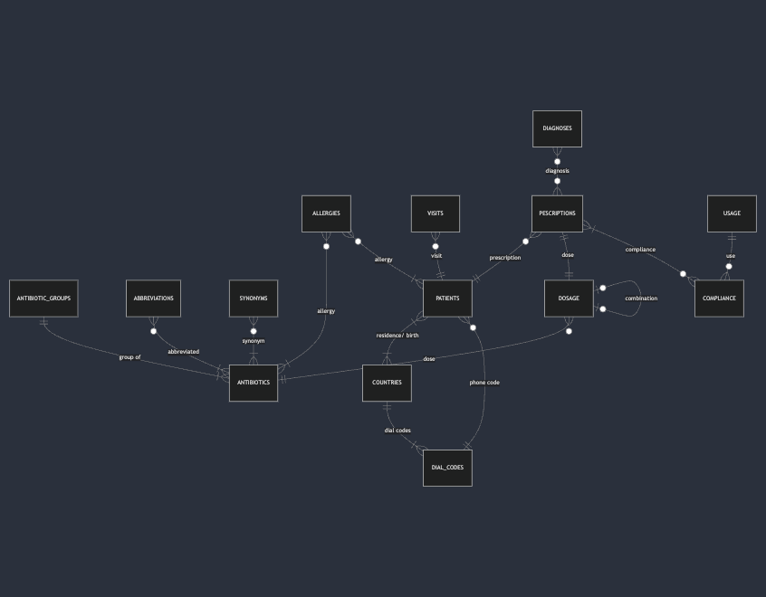

# About the Database
## Scope
The use of the database is primarily for healthcare workers to store information on their use of antibiotics.

Example datasets taken from [AMR (FOR R)](https://msberends.github.io/AMR/index.html).

Although the datasets taken as an example focus on the research of AMR and the microorganisms, this database focuses on storing and collecting the information of the patient by the health practicioner.


To further investigate the misuse and overuse of the antibiotics, more data is stored about their:
- Unique ID and compound ID
- Name, brand name, synonyms and abbreviation are included as they can be known or referred differently according to locations
- Dosage; The different type of dose given by the dataset are "standard  dosage", "high dosage" and "uncomplicated uti"

In the patient side of the dataset, the healthcare practitioner would be expected to record:
- location
    - to record the location of origin and residence of the patient.
- details of the patients
    - name
    - email
    - age
- their signs and symptoms
    - anatomy
    - signs
    - symptoms
- The type of medication and their dosage
    - duration of antibiotic therapy
    - timestamp, to monitor the frequency the patient was given antibiotic therapy
- The differential diagnosis/ reason for prescription
    - Map to the common reasons but can insert other reasons too
- Follow up on the patient's condition and their compliance to the mediation
    - healed, improved, worsen, no change
    - compliant, defaulted, intermittent

Out of scope are :
- Details of microorganism affected by the antibiotics and their resistance
- other non-antibiotic or antifungal related medication
- Further details to identify the patient
    - The table was simplified so informations such as the address, Identity number, etc was not included

## Functional Requirements

The database is expected to be of use to two groups of users:
- Healthcare practitioners prescribing antibiotics
- Reasearchers investigating the use and misuse of antibiotics

The healtcare practitioner will be able to:
- Register the patient's information and record the medication they are taking, as well as their symptoms
- They would also see the history of the antibiotics previously prescribed by the patient and see the frequency, compliance, or any other complications
- Should the patient be allergic to a certain antibiotics, the user will also be notified when prescribing

Researchers should be able to:
- Input information of the history of antibiotics use and misuse of patients
- Evaluate the common cause for antibiotics prescriptions and their frequency

Out of the scope of the database is other medications not listed
- The database priotise on collecting and analysing information for antibiotics and antifungals

## Entities

### `antibiotic_groups`
<details>
<summary>collection of unique groups of antibiotic</summary>

- `id`
    - Primary Key
    - `SMALL UNSIGNED NOT NULL`
- `name`
    - short and concise group name based on WHONET and WHOCC
    - `VARCHAR(32) NOT NULL`
</details>

### `antibiotics`
<details>
<summary>list of unique type of antibiotics</summary>

- `ab`
    - Antibiotic ID
    - The official EARS-Net (European Antimicrobial Resistance Surveillance Network) codes where available, unique
    - Primary Key
    - `CHAR(5) NOT NULL UNIQUE`
    - The official code for antibiotics are the unique combination of 3 letters, so the data type of `CHAR(3)` is used.
- `cid`
    - Compound ID as found in PubChem, unique
    - `INT UNSIGNED UNIQUE`
    - Although unique, some antibiotics in the dataset does not have a compound ID so they `NULL` value is allowed
- `name`
    - Official name as used by WHONET/EARS-Net or the WHO, unique.
    - `VARCHAR(64) UNIQUE`
- `group_id`
    - Foreign Key to `antibiotic_groups`'s `id`
    - `SMALL UNSIGNED NOT NULL`
</details>

### `abbreviations`
<details>
<summary>List of abbreviations for the antibiotics used in many countries</summary>

- `id`
    - Primary Key
    - `SMALLINT UNSIGNED NOT NULL UNIQUE AUTO_INCREMENT`
    - 484 abbreviations in the dataset so `SMALLINT` is used
- `ab`
    - Foreign Key to the unique ID of the antibiotic related to the `ab` column on the `antibiotics` table
    - `CHAR(3) NOT NULL`
- `abbreviation`
    - abbreviated name
    - `VARCHAR(32) NOT NULL`
</details>

### `synonyms`
<details>
<summary>often trade names of a drug, as found in PubChem based on their compound ID</summary>

- `id`
    - Primary Key
    - `SMALLINT UNSIGNED NOT NULL UNIQUE AUTO_INCREMENT`
    - 5933 synonyms in the dataset so `SMALLINT` is used
- `ab`
    - Foreign Key to the unique ID of the antibiotic related to the `ab` column on the `antibiotics` table
    - `CHAR(3) NOT NULL`
- `synonym`
    - The other name of the drug
    - `VARCHAR(32) NOT NULL`
</details>


### `dosage`
<details>
<summary>List of standard dosage for antibiotics</summary>

- `id`
    - Primary Key
    - `SMALLINT UNSIGNED NOT NULL UNIQUE AUTO_INCREMENT`
- `ab`
    -  Foreign Key referencing the `ab` column in the `antibiotics` table
- `type`
    - `ENUM('standard_dosage','high_dosage','uncomplicated_uti')`
    - Three types of dosage based on the dataset
- `dose`
    - There are variable ranges of doses either in gram, MU, mg/kg or a combination of different dose for antibiotics that are a combination of different material.
    - Thus, `VARCHAR` is used to include units of the dosage in the value
    - `VARCHAR(24) NOT NULL`
- `dose_times`
    - `TINYINT UNSIGNED`
    - Number of times dose must be administered
- `administration`
    - `ENUM('iv','oral','im')`
    - Allowed NULL because of some missing information in the csv dataset

</details>


### `countries`
<details>
<summary>List of countries and their unique three letter ISO 3166-1 alpha-3 codes </summary>

- `code`
    - Primary key
    - `CHAR(3) UNIQUE NOT NULL`
    - Added constraint to ensure the value inserted into this column is always uppercase
- `name`
    - The official english name of a country

</details>

### `dial_codes`
<details>
<summary>List of dial codes and the associated country</summary>

Separated from the `countries` table as there are some countries that share dial codes and some that have multiple

- `id`
    - Primary Key
    - `SMALLINT UNSIGNED NOT NULL UNIQUE AUTO_INCREMENT`
- `dial`
    - The dial code of the country without any '-' symbol.
    - `SMALLINT UNSIGNED NOT NULL`
- `country_code`
    - Foreign Key referencing the `code` column in the `countries` table

Added a unique constraint to ensure that there is no duplicate row of a country with a similar dial code.

</details>

### `patients`
<details>
<summary>Personal information of patients</summary>

- `id`
    - Primary Key
    - `INT UNSIGNED NOT NULL UNIQUE AUTO_INCREMENT`
- `full_name`
    - Full name of the patient
    - Although it is common for name of a person to be stored into first name and last name, this information is stored this way to take into consideration for cultures that does not have a surname or last name. From my experience living in Malaysia, where many does not have a last name and instead have their father's name following their first name, there had always been confusion on what should be included in the last name section of a formal form. This results in inconsistencies with the name in a particular form and the name in the National Identification Card.
    - `VARCHAR(100) NOT NULL`
- `email`
    - email of the patient, allowed `NULL` to take into consideration for patients without one.
    - `VARCHAR(100)`
- `dial_code_id`
    - Foreign key, referencing the `id` column in the `dial_codes` table
    - `SMALLINT UNSIGNED`
- `phone`
    - `VARCHAR(15)`
    - `CONSTRAINT digits_only_phone CHECK(phone is NULL or phone regexp '^[0-9]+$')`
    - Used `VARCHAR` instead of int to take into consideration of phone numbers that need to be stored with 0 as the leading character.
    - Constraint added to only allow digits to be stored in this column.
- `birth_date`
    - `DATE NOT NULL`
    - Stored in 'YYYY-MM-DD' format.
- `resident_country_code`
    - Foreign Key referencing the `code` column in the `countries` table
    - `CHAR(3) NOT NULL`
- `birth_country_code`
    - Foreign Key referencing the `code` column in the `countries` table
    - `CHAR(3) NOT NULL`
- `deleted`
    - 0 for false, 1 for true
    - `TINYINT UNSIGNED CHECK(deleted = 1 OR deleted = 0) DEFAULT 0`
    - Constraint added to only allow 1 or 0 only 

```
CONSTRAINT phone_dial_constraint CHECK (
    (phone IS NULL AND dial_code_id IS NULL)
    OR (phone IS NOT NULL AND dial_code_id IS NOT NULL)
)
```
The above constraint ensures that when a phone number is input, the dial code should also be input and vice versa. Otherwise if a patient does not have a phone number, both columns are allowed NULL values

</details>

### `allergies`
<details>
<summary>list of the antibiotics registered patients are allergic to</summary>

- `id`
    - Primary Key 
    - `INT UNSIGNED NOT NULL UNIQUE AUTO_INCREMENT`
- `patient_id`
    - Foreign Key referencing the `id` column in the `patients` table
- `ab`
    - Foreign Key referencing the `ab` column in the `antibiotics` table

Added constraint between `patient_id` and `ab` so that no duplicate of the same information.

</details>

### `visits`
<details>
<summary>Visit details of patients</summary>

- `id`
    - Primary Key
    - `INT UNSIGNED NOT NULL UNIQUE AUTO_INCREMENT`
- `patient_id`
    - Foreign Key referencing the `id` column in the `patients` table
- `visit_date`
    - `DATE NOT NULL`
    - The date of the patient's visit.
- `last_modified`
    - `DATETIME DEFAULT CURRENT_TIMESTAMP ON UPDATE CURRENT_TIMESTAMP`
    - The timestamp will automatically update with every update on the row.
- `note`
    - Record of the complaint, signs and symptom of the patient, as well as any note of any treatment done during this visit.
    - `VARCHAR(5000)`
- `deleted`
    - 0 for false, 1 for true
    - `TINYINT UNSIGNED CHECK(deleted = 1 OR deleted = 0) DEFAULT 0`

The `visits` table purposed is to collect information on the signs and symptoms of the patient.
For accountability:

</details>


### `prescriptions`
<details>
<summary>List of antibiotics prescribed or previously prescribed to patients</summary>

- `id`
    - Primary Key
    - `INT UNSIGNED NOT NULL UNIQUE AUTO_INCREMENT`
- `patient_id`
    - Foreign Key referencing the `id` column in the `patients` table 
    - `INT UNSIGNED NOT NULL`
- `dose_id`
    - Foreign Key referencing the `id` column in the `dosage` table 
- `prescription_date`
    - `DATE NOT NULL`
- `last_modified`
    - `DATETIME DEFAULT CURRENT_TIMESTAMP ON UPDATE CURRENT_TIMESTAMP`
- `deleted`
    - 0 for false, 1 for true
    - `TINYINT UNSIGNED CHECK(deleted = 1 OR deleted = 0) DEFAULT 0`

The purpose of this table is to record antibiotics prescribed to the patient by the current user or previously taken by the patients.
Often patients did not know what or why they were prescribed antibiotics, this also includes those who took antibiotics without prescriptions. Thus, the `dose_id` and `diagnosis_id` is allowed `NULL` so that it can be further investigated in the future.

</details>

### `diagnoses`
<details>
<summary>List of the common diagnosis for antibiotics usage.</summary>

- `id`
    - Primary Key
    - `SMALLINT UNSIGNED NOT NULL UNIQUE AUTO_INCREMENT`
- `diagnosis`
    - `VARCHAR(64) NOT NULL`

</details>

### `prescription_diagnosis`
<details>
<summary>The diagnoses for why the medication was prescribed</summary>

A prescription could be prescribed with no diagnosis or multiple diagnoses.
- `diagnosis_id`
    - Foreign Key referencing the `id` column in the `diagnoses` table 
    - `SMALLINT UNSIGNED NOT NULL UNIQUE AUTO_INCREMENT`
- `prescription_id`
    - Foreign Key referencing the `id` column in the `prescription` table 
    - `INT UNSIGNED NOT NULL UNIQUE AUTO_INCREMENT`

`PRIMARY KEY(diagnosis_id, prescription_id)` constraint added so that one prescription does not have duplicate of the same diagnosis

</details>

### `ab_usage`
<details>
<summary>List of common use and misuse of antibiotics</summary>

Created a table instead of `ENUM` for easier potential new insertion.
- `id`
    - Primary Key
    - `SMALLINT UNSIGNED NOT NULL AUTO_INCREMENT`
- `use`
    - `VARCHAR(64) NOT NULL`
    - How the antibiotic was used (ex: use of antibiotics without a prescription)

</details>

### `compliance`
<details>
<summary>A single prescription of antibiotics could have been misused in many ways, so a separate table is created to monitor the compliance of the medication.</summary>

- `prescription_id`
    - Foreign Key referencing the `id` column in the `prescription` table 
- `use_id`
    - Foreign Key referencing the `id` column in the `ab_usage` table 
Primary Key(`prescription_id`, `use_id`)

</details>


## Relationships

The below entitiy relationship diagram describes the relationships among the entities in the database.



As detailed by the diagram:

- An antibiotic:
    - Is part of one and only one of the antibiotic groups.
    - Could have 0 or many abbreviations or synonsyms.
    - Could have been listed in the dosage table for multiple type of doses or could not be listed.
- A patient:
    - Will be residing in the same or different country.
    - Have a dial code for their phone number on none if they did not have any phone number.
    - Could have 0 or many recorded clinical visits.
- A patient could be allergic to 0 or many antibiotics
- A prescription:
    - Record the antibiotic and the dose it was prescribed to the patient.
    - A prescription could have a diagnosis included or not.
    - Could have a record on the compliance on the usage of the antibiotic


## Optimisations

### Trigger:
<details>
<summary>delete_pt_cascade</summary>

- The patients, visits, and prescriptions table have a deleted column to allow for soft deletion.
- This trigger functions to alter the deleted column of in all the visits and prescriptions table where the patient id is the 'deleted' patient.
- This also work where the 'deleted' status of a patient is reversed.
</details>

### Views:
<details>
<summary>current_patients</summary>

- Views of patients not marked for deletion.
- Shows the phone with the dial code and the country names.
</details>

<details>
<summary>current_visits</summary>

- Views of visits not marked of deletion.
- Column for last modified timestamp not included.
</details>

<details>
<summary>current_prescriptions</summary>

- Views of prescriptions not marked of deletion.
- Column for last modified timestamp not included.
- Instead of only the dose id, the full dose elaborated.
</details>

### Stored Procedure:
<details>
<summary>visit_prescription_by_pt_id</summary>

- Takes in the patient id as an argument.
- Group the patient's visit and prescription by date.
- List out the note of the visit as well as the prescriptions.
</details>

<details>
<summary>allergy_trade_name_by_pt_id</summary>

- Takes in the patient id as an argument.
- List out all the trade name medication containing the antibiotic the patient is allergic to.
</details>

<details>
<summary>allergy_official_name_by_pt_id</summary>

- Takes in the patient id as an argument.
- List out the official name of the antibiotics the patient is allergic to.
</details>

<details>
<summary>diagnosis_compliance_by_pt_id</summary>

- Takes in the patient id as an argument.
- This table functions to show if the antibiotics was prescribed accordingly.
- The date column will show when it was prescribed, so it can be seen if it was prescribed too frequently.
- The diagnosis table will show the diagnosis, if any for why it was prescribed. 
- Further evaluation could be done to evaluate if the prescription was appropriate for the diagnosis.
- The compliance should be a follow up of the patient and how they had used the antibiotics.
</details>

<details>
<summary>search_ab</summary>

- Takes in string as an argument.
- Look through the official name, abbreviation, and synonym to find a match for the name of the antibiotic given by the argument and return its official name or a list of antibiotics mathcing the argument.
</details>

## Limitations

The current schema allows recording the antibiotic prescribed to a patient and recording the patient's compliance towards given prescription.
However, there is no relation of visits and prescription.
Although the visits and prescriptions can be viewed together, grouped by the prescription and visit date, there is currently no relation between both tables.
This is to allow recording of visits and prescription indipendently.
However, it is not convenient to view follow up visits after a particular visit or prescription to judge its effects.

## video overview
- short video no more than 3 minutes
- begin with an opening section that display's:
    - project's title
    - name
    - GitHub and edX usernames
    - city & country
    - date video recorded