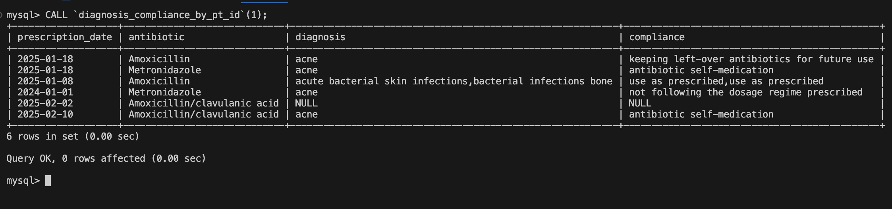
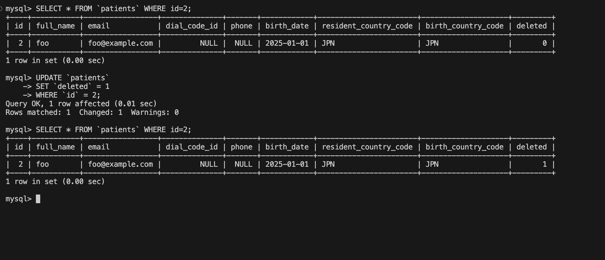
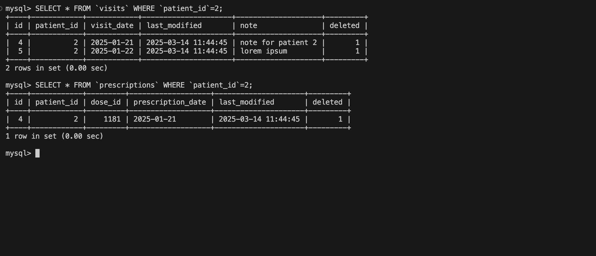
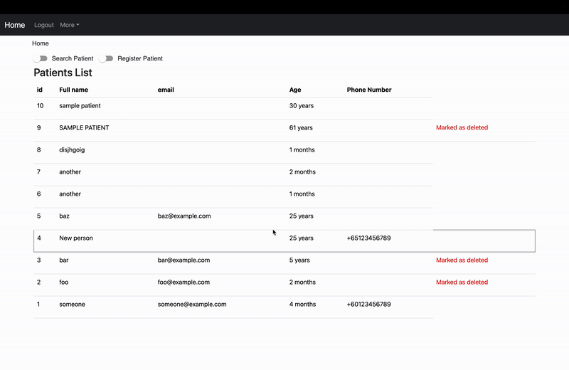
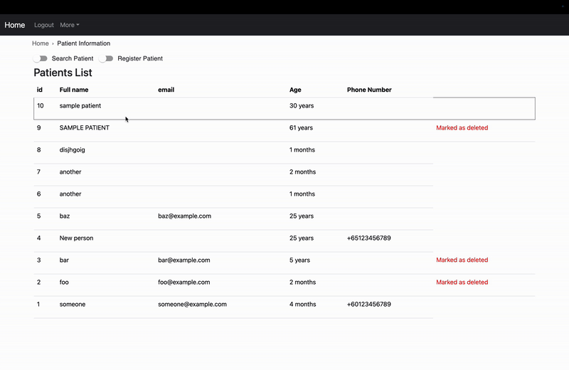
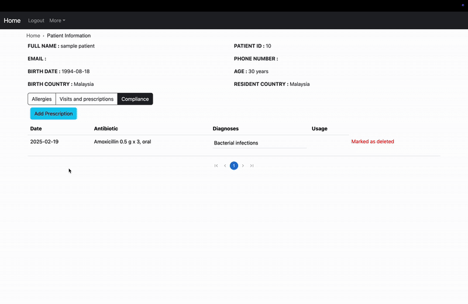
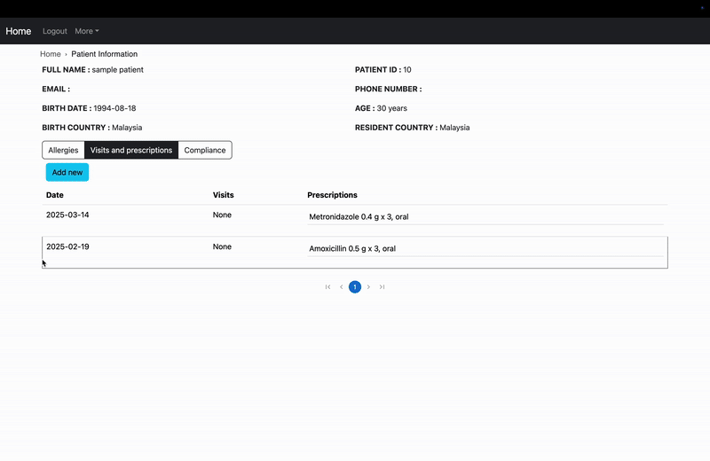
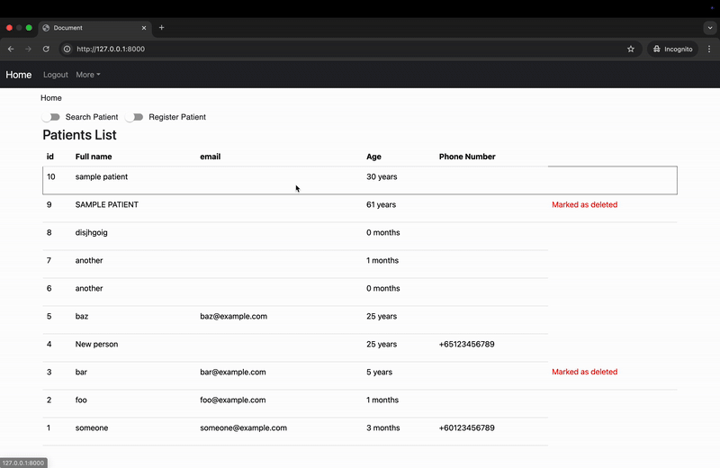

# ANTIBIOTICS DATABASE PROJECT
According to The World Health Organisation (WHO), AMR is one of the top global public health and development threats. It is estimated that bacterial AMR was directly responsible for 1.27 million global deaths in 2019 and contributed to 4.95 million deaths. [link](https://www.who.int/news-room/fact-sheets/detail/antimicrobial-resistance)

The misuse and overuse of antimicrobials in humans, animals, and plants are the main drivers in the development of drug-resistant pathogens.
## The database design [here](DESIGN.md)

## [YouTube Video URL of the project](https://youtu.be/g7YD6gS2-ws)

# Details on The Project Limitation
The project starts of as a final project for an SQL course, thus the database was designed and created in MySQL.
The following web application, made with Django and React, was made after the database was created to display the practical appliation of the database.

The Database was then imported to Django with the following command.

```
python3 manage.py inspectdb > backend/models.py
```
In the above command, `inspectdb` maps the database structure to the file `models.py`.
After some mofification on the Django Models, the application is now suited to query and modify the database.

However, the plan for proper migration for the application is to create a separate database and copy the data from the existing database.
But as the course requires the database to be created with the [schema.sql](schema.sql) file, no further action is taken

For the Django Application to be functionally optimised, it is assumed the information in the following tables are filled:
- antibiotic_groups
- antibiotics
- synonyms
- dosage
- ab_usage
- countries
- dial_codes
- diagnoses

# Project functionalities

##  MySQL Database
<details>
<summary> Views </summary>
The `current_patients`, `current_visits`, and `current_prescription` listed the data from each table that is not marked as deleted (deleted column = 0) while also concatinating and joining views from other tables.


</details>

<details>
<summary> Stored Procedures </summary>

<details>
<summary>`allergy_trade_name_by_pt_id` and `allergy_official_name_by_pt_id`</summary>

Takes in a patient's ID as a parameter and returns either the trade name or official name of the antibiotics the patient is allergic to.


</details>

<details>
<summary>`visit_prescription_by_pt_id`</summary>

Takes in a patient's ID as a parameter and returns the visit notes and dose of antibiotic prescribed to the patient grouped by date.


</details>

<details>
<summary>`search_ab`</summary>

Takes in a string as a parameter and matches it with the abbreviation, trade name and official names of antibiotics and returning the official name of the antibiotics.


</details>

<details>
<summary>`diagnosis_compliance_by_pt_id`</summary>

Takes in a patient's ID as a parameter and returns a list of all the antibiotics prescribed to the patient, their diagnosis, and the patient's compliance to each antibiotic


</details>

</details>

<details>
<summary> Trigger </summary>

The `patients`, `visits` and `prescriptions` tables each have a column `deleted`. In this column, the patient will be marked as deleted when the value is `1` and not deleted when the value is `0`.

The `delete_pt_cascade` will be triggered when the deleted status of a `patient` changed. If a patient is marked as deleted, the `visits` and `prescriptions` related to the patient will also be deleted.




</details>

## Web Application

<details>
<summary>Homepage</summary>

User can search or register new patients.


</details>

<details>
<summary>Patient's Details</summary>

### Allergies
User can add the antibiotics the patient is allergic to and view either the official name or the trade name.


### Compliance
User can add prescriptions, diagnosis and compliance as well as edit them.


### Visit Note and Prescription by Date
User can view, add, and edit visit notes and prescription.


</details>

<details>
<summary> Statistics page</summary>

### Antibiotics Statistics page
This page shows the statistics of the recorded antibiotics.


A pie chart will display the 5 most prescribed antibiotics and the percentage of those antibiotics over all of the prescribed antibiotics in the database.
- An alternative display is a table listing the number and percentages of all antibiotics prescribed

The top right bar chart will display the 5 most common cause of prescription of antibiotics. Calculated as the percentage of number of prescription with said diagnosis over all of the prescriptions. A prescription could have multiple diagnosis asigned to it.
- An alternative display is a table with the number and percentages of prescription associated to a list of diagnosis.

The line graph displays the number of prescription by month.
- By default, the graph displays statistics of the past 12 months.
- The graph could be manipulated to display statistics up to the past 10 years.

The bottom bar chart displays the statistics of compliance of antibiotics

### Patients Statistics page
The map, by default, shows the number of patients by resident country.
- This could be changed to show the number of patients by birth country.

The scatter plot displays the number of patients by age.

</details>


# Project files
<details>
<summary>
.github/workflows/cy.yml
</summary>

- Written to apply github Actions
- Every a push is made to the repository, it will automate the running of the test file.

</details>

<details>
<summary> 
test.py
</summary>

- This file will be run for testing during github actions
- A test database will be connected and populated with sample data from the csv files in hte [dataset_files](dataset_files) folder.

</details>

<details>
<summary>
SQL files
</summary>

<details>
<summary>
schema.sql
</summary>

- Contains the query run in MySQL to create the tables and views for the database.
</details>

<details>
<summary>
stored_procedures.sql
</summary>

- Contains the query run in MySQL to create the stored procedures for the database.
</details>

<details>
<summary>
privilege.sq
</summary>

- The list of privilege granted to the user 'test_user'.
</details>

<details>
<summary>
queries.sql
</summary>

- Contains the list of queries expected to be commonly run with the database.
</details>

</details>

<details>
<summary>
dataset_files
</summary>

- The CSV files in this folder contains the set of sample data used to populate the database during trial and testing.
- The Python files contains functions that takes in arguments to automate transferring the data from the CSV files to the database.
</details>

<details>
<summary>
database
</summary>

- This folder contains all the files for the Django web application.

<details>
<summary>
backend
</summary>

- The backend application for the Django project used for handling of API requests using Django REST Framework
</details>

<details>
<summary>
frontend
</summary>

- The frontend application for the Django project where the client side application is rendered using React
</details>
</details>